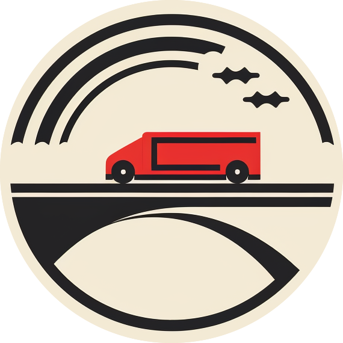

# Welcome to Pendel Hub - Your Commuting Disruptor

  

Pendel Hub is a groundbreaking public transportation app that revolutionizes how people commute. Users can create, share, and join routes, fostering a community-driven approach to transportation. The primary aim of the app is to alleviate the strain on public transportation and provide commuting solutions for areas with limited access to transit services. Additionally, users can post their specific commuting needs, helping identify routes with high demand and aiding government agencies in enhancing public transportation across Sweden.

## Features

- **Create Routes**: Users can easily create their own routes, specifying the starting point, destination and even price. This empowers users to share their daily commuting routes or any other routes they wish to create.

- **Subscribe to Routes**: Users can join routes created by others, becoming passengers on these routes. This feature fosters a collaborative community where people can share rides to common destinations.

- **Post Requested Routes**: Users with specific commuting needs can post requested routes. These routes can help identify high-demand areas and connect commuters with similar needs.

- **Contribute to Public Transportation Planning**: The data collected through the app can be invaluable for government agencies responsible for public transportation. By identifying high-demand areas, the app aids in optimizing existing transportation services and designing new ones.

## Getting Started

To access the live version of Pendel Hub, simply visit [ link not yet deployed ]() and start using the app right away.

## Contributing

We welcome contributions to enhance Pendel Hub further. If you encounter any issues or have ideas for improvements, please open an issue in this repository or reach out to our team directly.

- **Wishlist**: A few things we did not have time to implement during the two weeks run for the app development are:
- Map UI
- Search Functionality
- Pagination

## License

This project is licensed under the MIT License

## Contact Us

If you have any questions, suggestions, or feedback, feel free to contact our team at macovei.a2@gmail.com & lmo.gustavo@gmail.com

Thank you for being a part of Pendel Hub and contributing to more sustainable commuting solutions in Sweden! We appreciate your support and hope you find this app helpful in your daily commute.